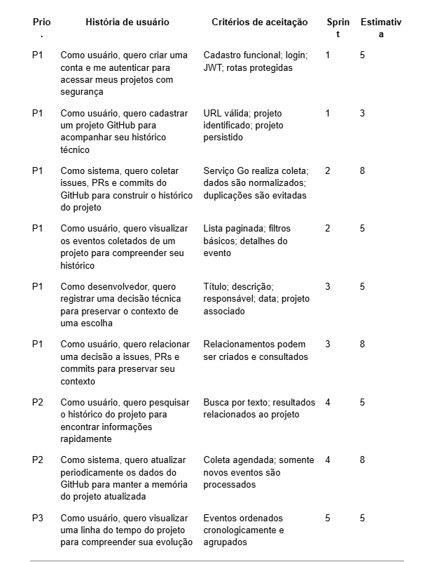

# Sentinel

## 1. Visão do produto 
**Declaração de visão**

    Para equipes de desenvolvimento de software
    Que perdem conhecimento e contexto importantes espalhados entre commits, pull requests, issues e decisões técnicas
    O SENTINEL é uma plataforma de memória operacional para projetos de software
    Que organiza e relaciona o histórico técnico de um projeto para tornar decisões e conhecimentos anteriores facilmente recuperáveis
    Diferente de ferramentas tradicionais de documentação e gerenciamento de tarefas, que armazenam informações de forma isolada
    Nosso produto conecta acontecimentos do projeto e seus contextos, permitindo compreender não apenas o que foi feito, mas também por que foi feito.

**Problema**

    Durante o desenvolvimento de um software, decisões importantes acabam distribuídas entre Git, issues, pull requests, documentação e conversas da equipe.
    Com o passar do tempo, torna-se difícil responder perguntas como:
    - Por que determinada tecnologia foi escolhida?
    - Quando e por que uma determinada regra foi criada?
    - Qual problema motivou determinada alteração?
    - Quais mudanças estão relacionadas a uma decisão antiga?
    - Por que determinada solução não foi utilizada?
    O SENTINEL busca transformar esse histórico fragmentado em uma memória consultável do projeto.

**Usuários-alvo**

    O MVP será direcionado principalmente a:
    - Desenvolvedores;
    - Tech leads;
    - Líderes técnicos;
    - Equipes de desenvolvimento de pequeno e médio porte.
    - O foco inicial será em equipes que utilizam GitHub como parte do fluxo de desenvolvimento.

## 2. Escolha entre Kotlin/Ktor e Java/Quarkus
**Decisão: Java + Quarkus**

    A equipe optará por Java com Quarkus para o serviço principal.
    A escolha considera quatro fatores principais.

**Perfil da equipe**

    O grupo já possui experiência profissional anterior utilizando Java, reduzindo a curva inicial de aprendizado e permitindo que a equipe concentre seus esforços nos desafios arquiteturais do SENTINEL, em vez de gastar grande parte do semestre aprendendo uma linguagem completamente nova.
    Ao mesmo tempo, o Quarkus permite explorar uma abordagem moderna de desenvolvimento de aplicações Java, especialmente em ambientes de microsserviços e containers.

**Características do domínio**

    O serviço principal será responsável por regras de negócio, autenticação, autorização, persistência e relacionamento entre os diferentes elementos do projeto.
    Java possui um ecossistema maduro para:
    APIs REST;
    persistência;
    autenticação;
    integração com bancos de dados;
    testes;
    microsserviços;
    aplicações containerizadas.
    O Quarkus também apresenta características adequadas para aplicações cloud-native, alinhando-se à arquitetura proposta para o projeto.

**Mercado e ecossistema**

    Java possui ampla utilização no mercado profissional, principalmente em sistemas corporativos e backend. A escolha permite que o projeto também tenha relevância prática para a formação profissional da equipe.

**Diferenciação didática**

    Embora Java seja uma tecnologia conhecida pelo grupo, a utilização do Quarkus em conjunto com microsserviços Go permite explorar uma arquitetura diferente daquela utilizada tradicionalmente em aplicações monolíticas.
    A equipe poderá estudar na prática aspectos como comunicação entre serviços, processamento assíncrono, containers, concorrência e integração com APIs externas.

**Decisão final**

    Java + Quarkus será utilizado como núcleo do SENTINEL, enquanto Go será utilizado para tarefas de integração e processamento concorrente.
    A escolha não ocorre apenas pela familiaridade com Java, mas pela possibilidade de utilizar a experiência prévia da equipe para construir uma arquitetura mais complexa e concentrar o aprendizado em problemas distribuídos.

## 3. Divisão entre serviço principal e microsserviços Go
    A arquitetura inicial será composta por um serviço principal em Java/Quarkus e um componentes em Go.

**Serviço principal — Java/Quarkus**
    
    Será responsável por:
    
    - Entidades do domínio;
    - Projetos;
    - Usuários;
    - Repositórios;
    - Decisões técnicas;
    - Relacionamentos entre eventos;
    - Regras de negócio;
    - Autenticação e autorização;
    - Persistência;
    - Migrações do banco;
    - API REST;
    - Orquestração dos casos de uso.

    O serviço principal será a fonte de verdade do domínio do SENTINEL.

**Microsserviço de ingestão — Go**

    O Go será responsável principalmente pela comunicação com sistemas externos.
    Inicialmente, o alvo será o GitHub.

    O serviço deverá:

    - Conectar-se a um repositório;
    - Consultar informações de issues;
    - Consultar pull requests;
    - Consultar commits;
    - Normalizar os dados;
    - Identificar novos eventos;
    - Enviar os dados processados para o serviço principal.
    A utilização de Go é justificada pela natureza predominantemente I/O-bound e concorrente dessa tarefa, já que a coleta pode envolver diversas requisições externas.

Possível processamento assíncrono — Go

    Conforme a evolução do projeto, o serviço Go poderá processar eventos de forma assíncrona.
    
    Por exemplo:
```
GitHub
   ↓
Microsserviço Go
   ↓
Normalização / processamento
   ↓
Java / Quarkus
   ↓
Banco de dados
```

    Isso permite que o serviço principal não fique diretamente responsável por todo o trabalho de comunicação com sistemas externos.

## 4. Modelo conceitual do SENTINEL
O conceito central do sistema será tratar o projeto como uma coleção de eventos técnicos relacionados.

    Por exemplo:
```
Issue
  │
  ├── Pull Request
  │       │
  │       └── Commit
  │
  └── Decisão técnica
          │
          └── Alteração relacionada
```

    Assim, uma decisão deixa de ser apenas um registro textual.
    Ela poderá estar relacionada a acontecimentos concretos do projeto.
    
    Exemplo: 
    
    - Decisão: utilizar PostgreSQL no módulo de pagamentos.

    Relacionamentos:
```
Decisão
 ├── Issue #42
 ├── Pull Request #51
 └── Commit abc123
```
    Isso constitui a principal diferenciação do produto.

## 5. Definição do MVP
    O MVP terá como objetivo permitir que uma equipe conecte um projeto GitHub ao SENTINEL e construa uma primeira memória estruturada daquele projeto.

**Dentro do MVP:**
- Cadastro de usuário

- Autenticação

- Cadastro de projetos

- Integração com GitHub

- Coleta de issues

- Coleta de pull requests

- Coleta de commits

- Persistência dos eventos

- Registro de decisões técnicas

- Relacionamento entre decisões e eventos

- Busca textual

- Histórico básico do projeto

- Processamento da coleta em Go

- API REST

- Testes automatizados

**Fora do MVP:**
- IA generativa para responder perguntas

- Geração automática de decisões

- Busca semântica com embeddings

- Integração com GitLab

- Integração com Jira

- Slack/Discord

- Dashboard avançado de métricas

- Aplicativo mobile

- Recomendações automáticas

- Análise preditiva do projeto

A inteligência artificial será deliberadamente deixada fora do MVP.

Isso é importante porque o valor inicial do SENTINEL não depende de simplesmente adicionar um chatbot. Primeiro será construída uma base estruturada e relacionada do conhecimento do projeto. Uma camada de IA poderá ser adicionada posteriormente sobre essa base.

## 6. Hipótese de valor
Acreditamos que equipes de desenvolvimento vão utilizar o SENTINEL para recuperar decisões e contextos técnicos de projetos antigos porque centralizar e relacionar o histórico do desenvolvimento reduz o tempo necessário para compreender por que determinadas soluções foram adotadas.

A hipótese poderá ser validada observando se usuários conseguem responder perguntas sobre o histórico de um projeto utilizando o SENTINEL sem precisar procurar manualmente em diversas ferramentas.

## 7. Exemplo de utilização
Imagine que uma equipe encontre uma parte antiga do sistema utilizando determinada biblioteca.
Um desenvolvedor pode consultar:
"Por que essa biblioteca foi escolhida?"
O SENTINEL poderá apresentar:
Decisão #17

Utilizar Biblioteca X no módulo Y.

Motivo:
Necessidade de suporte à funcionalidade Z.

Relacionamentos:
- Issue #31
- Pull Request #44
- Commit 8f31a2
- Issue #52

Criada em:
12/09/2026

Responsável:
Desenvolvedor X

Em vez de procurar manualmente em dezenas de commits, issues e PRs, o desenvolvedor encontra o contexto reunido em um único lugar.

## 8. Backlog inicial
As prioridades seguem:
- P1: essencial para o MVP;
- P2: importante;
- P3: desejável.



## 9. Organização inicial dos Sprints
### Sprint 1 — Fundação
└── Objetivo: deixar o sistema executável e estabelecer o núcleo do domínio.

- Configuração do monorepo;
- Java + Quarkus;
- Go;
- Docker;
- CI;
- Banco de dados;
- Migrações;
- Autenticação;
- Estrutura inicial das entidades;
- Cadastro de projetos.

**Resultado esperado: usuário autenticado consegue criar e consultar um projeto.**

### Sprint 2 — Ingestão
└── Objetivo: conectar o SENTINEL ao GitHub.
- Microsserviço Go;
- Integração com API do GitHub;
- Coleta de issues;
- Coleta de PRs;
- Coleta de commits;
- Normalização;
- Comunicação Go → Java;
- Deduplicação;
- Persistência.

**Resultado esperado: um projeto conectado começa a construir automaticamente seu histórico.**


### Sprint 3 — Memória
└── Objetivo: transformar os dados coletados em conhecimento estruturado.
- CRUD de decisões;
- Relacionamento entre decisões e eventos;
- Issues relacionadas;
- PRs relacionadas;
- Commits relacionados;
- Consultas do histórico.

**Resultado esperado: uma decisão técnica pode ser registrada e vinculada aos acontecimentos que deram origem a ela**.

### Sprint 4 — Recuperação
└── Objetivo: tornar a memória útil para o desenvolvedor.
- Busca textual;
- Filtros;
- Atualização periódica;
- Processamento assíncrono;
- Melhorias de performance;
- Testes de integração.

**Resultado esperado: o usuário consegue encontrar rapidamente informações relevantes do histórico.**

### Sprint 5 — Consolidação
└── Objetivo: finalizar o MVP e preparar a apresentação.
- Linha do tempo;
- Melhorias de UX;
- Testes;
- Observabilidade;
- Tratamento de erros;
- Documentação;
- Segurança;
- Pipeline CI/CD;
- Revisão arquitetural.

**Resultado esperado: MVP estável e demonstrável.**

## 10. Arquitetura inicial
```
                        ┌──────────────────┐
                         │      GitHub      │
                         └────────┬─────────┘
                                  │
                                  │ API
                                  ▼
                         ┌──────────────────┐
                         │  Go Ingestion    │
                         │   Microservice   │
                         └────────┬─────────┘
                                  │
                            eventos normalizados
                                  │
                                  ▼
┌───────────────┐         ┌──────────────────┐
│   Frontend    │ ──────► │  Java / Quarkus  │
│   do sistema  │  REST   │  Core Service    │
└───────────────┘         └────────┬─────────┘
                                   │
                         ┌─────────┴─────────┐
                         │                   │
                         ▼                   ▼
                  ┌────────────┐      ┌─────────────┐
                  │ PostgreSQL │      │    Cache    │
                  └────────────┘      └─────────────┘
```

## 11. Estrutura inicial do monorepo
```
sentinel/
│
├── services/
│   ├── core/
│   │   └── quarkus/
│   │
│   └── ingestion/
│       └── go/
│
├── frontend/
│
├── infra/
│   ├── docker/
│   └── database/
│
├── docs/
│
├── .github/
│   └── workflows/
│       └── ci.yml
│
├── .gitignore
│
├── LICENSE
│
├── CONTRIBUTING.md
│
├── proposta.md
│
├── public/
│   └── image.png
│
└── README.md

```

**A estrutura permite que cada serviço possua seu próprio ciclo de desenvolvimento sem abandonar a organização central do monorepo.**

## 12. Critério de sucesso do MVP
O MVP será considerado funcional quando uma equipe conseguir:
1. Criar uma conta;
2. Cadastrar um projeto GitHub;
3. Solicitar a importação do histórico;
4. Ter issues, PRs e commits coletados pelo serviço Go;
5. Visualizar esses eventos no SENTINEL;
6. Criar uma decisão técnica;
7. Relacionar essa decisão aos eventos relevantes;
8. Pesquisar posteriormente essas informações;
9. Recuperar o contexto de uma decisão sem consultar manualmente o GitHub.

### O principal indicador de valor será:

Conseguir recuperar o contexto de uma decisão técnica de um projeto de forma mais rápida do que procurando manualmente entre issues, commits e pull requests.

## 13. Diferencial do produto
O SENTINEL não pretende ser mais uma ferramenta de gerenciamento de tarefas.

Seu diferencial está em transformar o histórico de desenvolvimento em uma estrutura de conhecimento relacionada.

A primeira versão não tentará "entender tudo" automaticamente.

Ela construirá a infraestrutura necessária para que, posteriormente, recursos mais avançados possam ser adicionados, como:

- busca semântica;
- geração automática de resumos;
- identificação de decisões;
- perguntas em linguagem natural;
- reconstrução automática do contexto de uma alteração;
- detecção de conhecimento potencialmente perdido;
- integração com múltiplas ferramentas de desenvolvimento.

Assim, a evolução natural do produto seria:
```
Histórico estruturado
        ↓
Relacionamentos
        ↓
Busca inteligente
        ↓
Busca semântica
        ↓
IA sobre o conhecimento
        ↓
Memória operacional inteligente
```

### Videos:

https://drive.google.com/file/d/1_UqOB8U5I0igBoKNTvT8Q8m4mYwTNIJe/view
https://drive.google.com/file/d/1K44g8bbhSyI1jahGi-0p1Ez55z3CALA7/view
Isso mantém o projeto ambicioso o suficiente para ser interessante, mas evita que o grupo dependa de IA ou de uma infraestrutura excessivamente complexa para entregar o MVP em um semestre.

